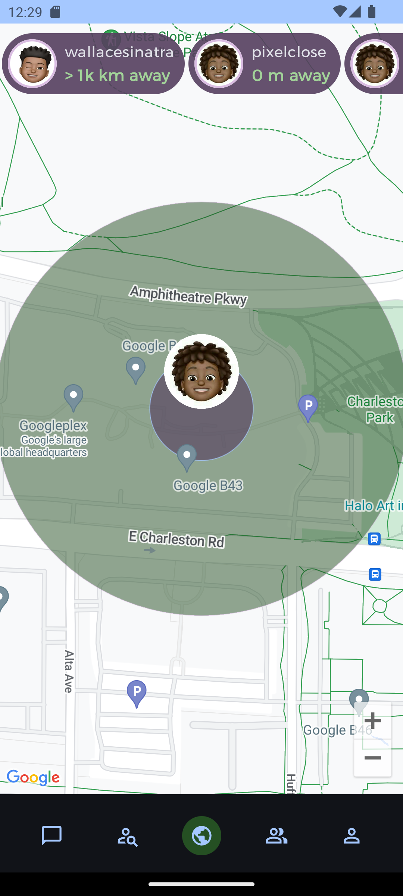

# Close

Close application reimagines social networking by prioritizing physical proximity for meaningful interactions

Promotes spontaneous meetups and serendipitous encounters among nearby users.
Seeks to enrich social experiences by fostering genuine connection in the digital age.

## Features include

    - location-based delivery
    - real-time messaging
    - seamless navigation

### Objectives

1. Implement map functionality to display the user's location and locations of nearby friends.
2. Develop a chat interface to enable real-time communication between users
3. Integrate navigation features to allow users to navigate to their friends' location.
4. Store user data securely and manage friend relationships within the app.

## Technology used

- **Kotlin**
- **Jetpack Compose**
- **Firebase Auth**
- **Firebase Firestore**
- **Google Maps**

## Previews

    
    
    
    

## Download Close APK

<a href="app/build/outputs/apk/debug/app-debug.apk" download="download Close App APK">

download Close App APK

</a>

